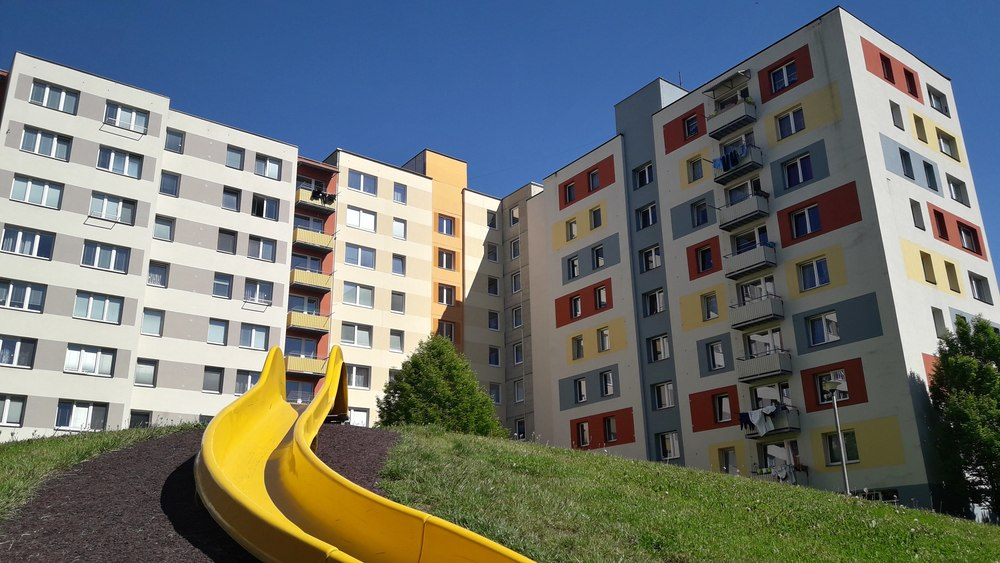
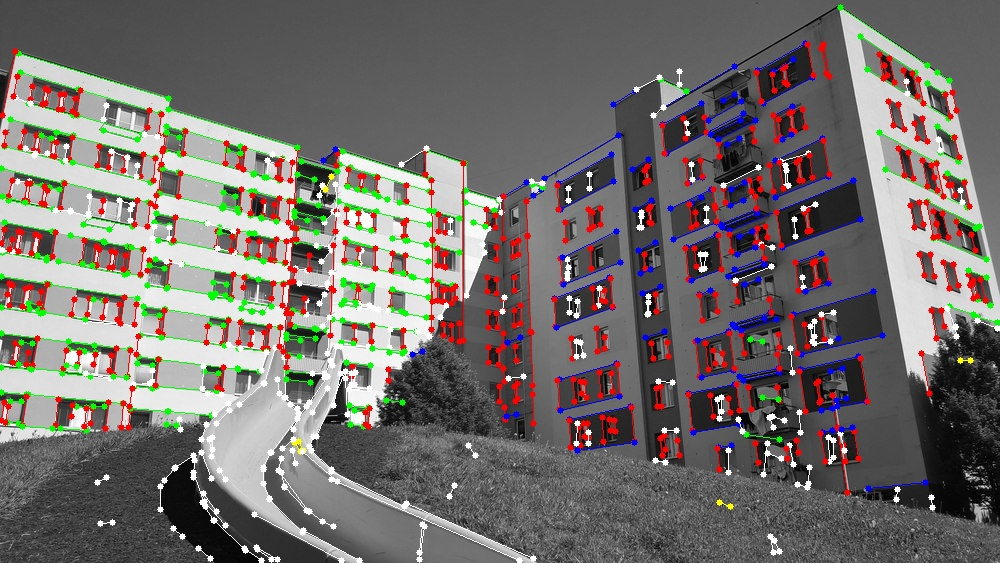
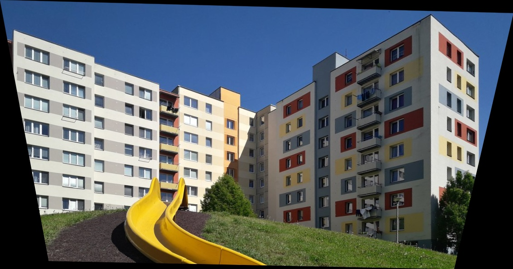

# `librectify`
&copy; 2020, Roman Juranek <ijuranek@fit.vutbr.cz>

Minimalistic library for image perspective correction. The library prvides API for automated identification of converging line groups and image transform computation from automatic identification of two orthogonal vanishing points. The library does not warp the image, this is in the hands of the user.

_Development of this software was funded by
TACR project TH04010394, Progressive Image Processing Algorithms._

## Dependencies
The library requires no external dependencies (apart from standard library and OpenMP runtime). Internally we use Eigen for representation of images and linear algebra.
Example app uses OpenCV for image IO and warping.

## Algorithms

* Basic image processing (convolution, morphology, local maxima, flood)
* Basic geometry processing in homogrneous coordinates
* Eigen value solver
* RANSAC, PROSAC, Hough Transform

## Documentation

[C++ API](doc/cpp_api.md)

## Example

Input image


Automatically detected lines by `find_line_segment_groups`. The function accepts `float` image buffer, its dimmensions and stride between rows and returns allocated array of `LineSegment` structures which can by modified (filtering, user input, etc.).



The library provides corners for image transformation with function  `compute_rectification_transform`. The function accept line segments and returns `ImageTransform` structure with new image corners.

```
top_left: -60.5308,-13.6642
top_right: 1041.69,-54.4891
bottom_left: 55.0519,649.464
bottom_right 969.276,621.39
```

There are more than one _strategy_ how to calculate the transform - user can specify what should happen in horizontal/vertical direction. The options are - rectify, rotate (by horizontal or vertical angle) or do nothing. There are 15 meaningful combinations suitable for different use cases. The responsibilit of user is then to use the corners to calculate the final image.

Here is an example of warped image  calcualted by `cv::warpPerspective` (see `autorectify.cpp` for code).



---

[Change log](ChangeLog.md)