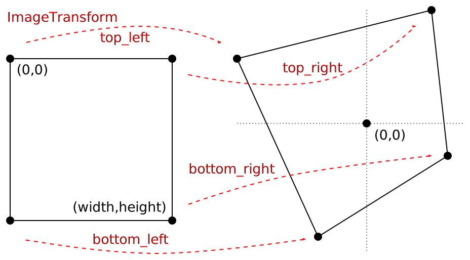

# API documentation

The library API is enclosed in the namespace `librectify` and it procides basci functions for analysis of lines in image and calculating image transforms.

## Data model

We work with **grayscale** image in `float` array. We expect a pointer to a buffer, image dimensions (width and height), and stride between rows (which can be negative).

Image of size `WxH` with stride `S` at address `X` can be passed either as
1. buffer=X, stride=S, or
2. buffer=X+S*(H-1), stride=-S

Both versions are semantically equivalent.

## Types

### `InputPixelType`

```c++
using InputPixelType = float
```

Expected data type of image pixels.

## Enums

### `RectificationStrategy`

```c++
enum RectificationStrategy
{
    ROTATE_H,
    ROTATE_V,
    RECTIFY,
    KEEP,
};
```

Controls how the transform is calculated in `RectificationConfig`. This can be set for vertical and horizontal direction independently. The meaning of the individual values is:

* `ROTATE_H` - Rotation by angle defined by horizontal vanishing point.
* `ROTATE_V` - Rotation by angle defined by vertical vanishing point.
* `RECTIFY` - Full rectification - alignment of lines with an axis
* `KEEP` - Do nothing

## Structures

### `LineSegment`
```c++
struct LineSegment
{
    float x1, y1, x2, y2;
    float weight;
    float err;
    int group_id;
};
```

Holds a single line segment with endpoints `(x1,y1)` and `(x2,y2)`. `weights` is an average response of edge detector on pixels belonging to the segment, and `err` is average reprojection error of the pixles. `group_id` is the identifier of the group to which the line was assigned - lines with the same `group_id` points towards common vanishing point.

### `Point`

```c++
struct Point
{
    float x, y, z;
};
```

A point at location `(x,y)`. It can be either finite (`z==1`) or infinite (`z==0`) in which case `(x,y)` is direction in which the point lies.

### `ImageTransform`

```c++
struct ImageTransform
{
    int width;
    int height;
    Point top_left, top_right, bottom_left, bottom_right;
    Point horizontal_vp;
    Point vertical_vp;
};
```

Definition of image transformation. `width` and `height` of is the image size in pixels. `top_left`... fields are new coordinates of the image corners and `horizontal_vp` and `vertical_vp` are coordinates of vanishing points from which the transform was calculated. Note that locations of vanishing points are in the image space of the source image. New coordinates are in different space and must be translated to correct locations (which is intentionaly left for the user).




### `RectificationConfig`

```c++
struct RectificationConfig
{
    float vertical_vp_angular_tolerance;
    float vertical_vp_min_distance;
    RectificationStrategy v_strategy;
    float horizontal_vp_min_distance;
    RectificationStrategy h_strategy;
};
```

Configures how the transformation will be computed.

Vertical vanishing point will be searched in vertical direction in `(-a, +a)` degrees (where `a` is `vertical_vp_angular_tolerance`) at minimum distance `vertical_vp_min_distance`.


The distance is a fraction of image half-diagonal size, i.e. `horizontal_vp_min_distance = 1` in image with size `(500x500)` is `sqrt(500^2 + 500^2) / 2 ~= 353` pixels. Allowing vanishing points width distance <1 can result in degenerate transform.

## Interface

### `find_line_segment_groups`

```c++
LineSegment * find_line_segment_groups(
    InputPixelType * buffer, int width, int height, int stride,
    float min_length, bool refine,
    int num_threads,
    int * n_lines);
```

Detect line segment in an image. The format of the image buffer is defined in the _Data model_ section.

* **buffer** - Pointer to `float` array
* **width**, **height** - Size of the image
* **stride** - Step between rows in `float` elements
* **min_length** - Minimal length of detected line
* **refine** (experimental) - Line refinement - connect close lines
* **num_threads** - Number of threads to use
* **n_lines** - Output parameter for the number of lines.

The function returns an allocated array of `LineSegment` structures. The number of lines in stored in `n_lines`. These lines can be freely modified or filtered. The array must be released by `release_line_segments`.

### `release_line_segments`
```c++
void release_line_segments(LineSegment ** lines);
```

Release the allocated array of `LineSegments` and set the original pointer to `NULL`. Use this function **only** on arrays returned by `find_line_segmen_groups`.


### `compute_rectification_transform`
```c++
ImageTransform compute_rectification_transform(
    LineSegment * lines, int n_lines,
    int width, int height,
    const RectificationConfig & cfg);
```

Calculate `ImageTransform` from line segments.

* **lines**, **n_lines** - Detected line segments
* **width**, **height** - Image size in pixels
* **cfg** - Transform configuration

The function returns `ImageTransform` structure which can be used to calculate projective transform. The corners are in the image-space of the original image (center of the origianl image is mapped to the center of the transformed image) and some coordiantes can be negative. See `autorectify.cpp` how to calculate correct boundiing box and size of the transformed image.


### `compute_rectification_transform_from_vp`
```c++
ImageTransform compute_rectification_transform_from_vp(
    int width, int height,
    const Point & vp_h, const Point & vp_v);
```

* **width**, **height** - Image size
* **vp_h** - Coordinated of horizontal vanishing point (in pixels)
* **vp_v** - Coordinated of vertical vanishing point (in pixels)

The output matches that of `compute_rectification_transform`.


### `fit_vanishing_point`
```c++
Point fit_vanishing_point(
    const LineSegment * lines, int n_lines,
    int group);
```

* **lines**, **n_lines** - Detected line segments
* **group** - Group for which the vp is calculated

Returns a point calculated from lines with `group_id == group` or from all the lines when `group` is negative.


### `assign_to_group`
```c++
void assign_to_group(
    const LineSegment * lines_array, int n_lines,
    LineSegment * new_lines_array, int n_new_lines,
    float angular_tolarance);
```

Get `group_id` for new lines by assigning then to groups in base lines.

* **lines_array**, **n_lines** - Base line segments
* **new_lines_array, n_new_lines** - Line segments to assign
* **angular_tolerance** - Assignment tolerance

Each line of the `new_lins_array` is modified by assigning `group_id` member field. The lines are assigned by checking inclination to vanishing points fromed by `lines_array`.


---
&copy; 2020 Roman Juranek